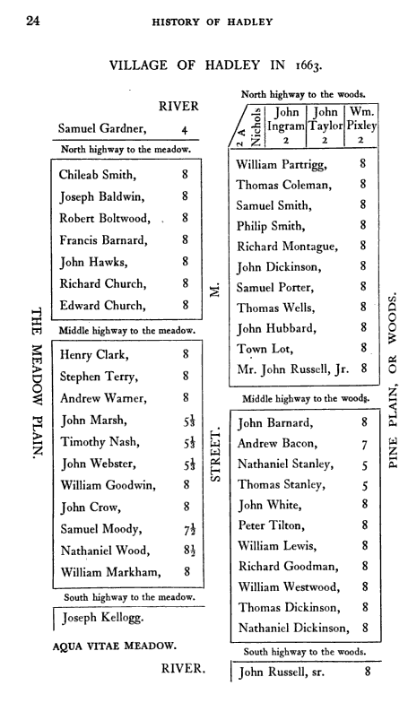

[The Early Barnard Settlers: Francis Barnard](http://web.archive.org/web/20201125224005/http://strongfamilyofamerica.org/2012/04/the-early-barnard-settlers-francis-barnard/)

Posted on [April 22, 2012](http://web.archive.org/web/20201125224005/http://strongfamilyofamerica.org/2012/04/the-early-barnard-settlers-francis-barnard/) by [Edward Barnard](http://web.archive.org/web/20201125224005/http://strongfamilyofamerica.org/author/admin/)

The fol­low­ing mate­r­ial is from *Fran­cis Barnard (ca. 1616–1698) and his Descen­dants, A Genealog­i­cal Study, Part A*, by Walther M. Barnard, Ver­sion of 09 August 2009, pages 2–10. Used with permission.

Fran­cis Barnard1 (ca. 1616–1698)

Fran­cis emi­grated from Eng­land, arrived in Mass­a­chu­setts (as did sev­eral other unre­lated Barnards), and was among the early set­tlers of Hart­ford, Con­necti­cut (cer­tainly by 1644, per his mar­riage there), and Hadley and Deer­field, Mass­a­chu­setts (1659 and 1673, respec­tively). Prior to the Amer­i­can Rev­o­lu­tion­ary War (1775–1783), his descen­dants resided prin­ci­pally in Mass­a­chu­setts and Con­necti­cut. There­after, some removed to Ver­mont, and many migrated west­ward, set­tling mainly in New York, Penn­syl­va­nia, Ohio, Indi­ana, Illi­nois, Michi­gan, and Wis­con­sin (or the ter­ri­to­ries that sub­se­quently formed these states). Many Loy­al­ists (“Tories”) removed to Nova Sco­tia and Lower Canada (Ontario) dur­ing and imme­di­ately fol­low­ing the Rev­o­lu­tion­ary War. Today descen­dants of Fran­cis live through­out the United States and Canada.

Fred­er­ick Adams Virkus, edi­tor, *Immi­grants to Amer­ica Before 1750: An Alpha­bet­i­cal List of Immi­grants to the Colonies,before 1750, com­piled from offi­cial and other records* (orig­i­nally pub­lished Chicago, 1929–1932; exerpted from The Mag­a­zine of Amer­i­can Geneal­ogy, Sec­tion IV, Num­bers 1–27, Bal­ti­more: Genealog­i­cal Pub­lish­ing Co., 1965, p. 169), gives the fol­low­ing for Fran­cis and his imme­di­ate descen­dants *\[for­mat­ted for eas­ier read­ing online\]*:

***BARNARD (Bernard), Francis***

* *(b. Coven­try, Eng., abt. 1617-d. Hadley, Mass., Feb. 3, 1698),*
* *came from Eng. to Dorch­ester, Mass., 1636, in the “Freelove;”*
* *set­tled at Hart­ford, Conn., by 1644;*
* *mal­ster;*
* *removed to Hadley, abt. 1659; free­man, 1666;*
* *lived in Deer­field few years but returned to Hadley, 1673;*
* *peti­tioned the gov­ern­ment for money due him, 1683;*
* *m. 1st, Hart­ford, before Aug. 16 or 26, 1644, Han­nah Mer­rill or Meruil or Mar­vin (d. Hadley, 1676), prob. sis­ter of Matthew Mar­vin and Rein­hold Marvin;*
* *m. 2d, Aug. 21, 1677, Frances (Foote) Dick­en­son, dau. of Nathaniel Foote and widow of John Dickenson;*

*issue (1st marriage):*

*1–Hannah (b. abt. 1646-d. May 13, 1739);*

* *m. 1st, Oct. 9 or 17, 1667 (Shel­don says 1669), John West­car (d. Sept. 1675), of Hadley; physician;*
* *m. 2d, Oct. 9, 1680, Simon Bea­man, of Hadley and Deerfield;*

*2-Joseph (b. Hart­ford, abt. 1648-d. Deer­field, Sept. 6 or 18, 1695), set­tled at Northamp­ton, Mass.;*

* *removed to Deerfield;*
* *mor­tally wounded by Indi­ans, Aug. 18, 1695;*
* *m. (Sav­age says July 13 or Dec. 13, 1675 or Jan. 13, 1675/76), Sarah (b. 1656-d. Deer­field, Feb. 10, 1734), dau. of Elder John Strong, of Northamp­ton (she m. 2d, 1698, Capt. Jonathan Wells);*
* *6 sons, 5 daus.;*

*3-Samuel (b. abt. 1654-d. Oct. 17, 1728), set­tled at Hat­field, Mass.;*

* *free­man, 1678;*
* *styled capt.;*
* *m. Nov. 5, 1678 (Shel­don says, Oct. 30, 1678), Mary Colton (b. abt. 1651-d. Mar. 4 or 5, 1709), dau. of George Colton, of Long­meadow, Mass.;*
* *2 sons, 3 daus.;*

*4-Thomas (b. abt. 1657-d. Oct. 13, 1718), Har­vard Col­lege, 1679;*

* *set­tled at Andover, Mass.;*
* *ordained as col­league with Dane, 1682;*
* *m. 1st, Dec. 14, 1686, Eliz­a­beth (d. Oct. 10, 1693), dau. of Theodore Price, of Salem, Mass.;*
* *m. 2d, Apr. or May 28, 1696, Abi­gail Bull (d. Aug. 19, 1702);*
* *m. 3rd, July 20, 1704, Lydia Goffe;*
* *issue (1st mar­riage): 3 sons;*

*5-John (kld. at Bloody Brook, Sept. 18, 1675), no issue;*

*6-Sarah (d. Hadley, 1676);*

*(see A36-A317-C810-C1126a-C1127i-E378-G164-G190-IAG45-M669h-M670w-M671k-M671m-M1432-S1822). \[Note: The par­tial list of books given on p. 6 of this book gives only the fol­low­ing: A36-Abridged Com­pendium of Amer­i­can Geneal­ogy; A317-American Ances­try; G164-Genealogical Dic­tio­nary of the First Set­tlers of New England.\]*

The 1636 arrival date of Fran­cis has also been noted in a type­cript of fam­ily his­tory and geneal­ogy “list” writ­ten by Juli­enne Barnard (1892–1986) (a 9th gen­er­a­tion descen­dant of Fran­cis): “D’après la com­pi­la­tion généalogique du Media Research Bureau, de Wash­ing­ton, B.C. \[MRB. 1110 P. Street, Wash­ing­ton D.C. — The Name and Fam­ily of Barnard. Copie dacty­lo­graphiée p. 3.\], Frances Barnard, le chef de cette 1ignêe, venait de Coven­try (War­wick), Angleterre, vers 1636, s’établir dans ce qu’on appelait alors le Nou­veau Monde.”

At the present time, lit­tle is known about the antecedents of Fran­cis and his rela­tion­ship to the other early Barnards. **Fran­cis has been linked as a brother to Bartholomew (died ca. 1698), an early set­tler of Hart­ford, from whom is descended another promi­nent line of Barnards in cen­tral Con­necti­cut, and to their sup­posed com­mon father and grand­fa­ther, but there is no con­crete evi­dence to sup­port these rela­tion­ships, not with­stand­ing a pro­lif­er­a­tion of pedi­grees posted on the Inter­net.** How­ever, both Fran­cis and Bartholomew set­tled in fledg­ling Hart­ford. Ulti­mately, the **Barnard Sur­name DNA Project** (posted on the Inter­net at [www.family.dranrab.com](http://web.archive.org/web/20201125224005/http://www.family.dranrab.com/)) may estab­lish the exis­tence or non-existence of the rela­tion­ship between Fran­cis and Bartholomew.

Of Fran­cis’ kins­man­ship to a John Barnard we have more sub­stance. Henry R. Stiles, 1892, *The His­tory and Genealo­gies of Ancient Wind­sor, Con­necti­cut; Includ­ing East Wind­sor, South Wind­sor, Bloom­field, Wind­sor Locks, and Elling­ton, 1635–1891*, v. II, p. 58, refers to John as the “brother” of Fran­cis (although he could have been an uncle, cousin, or other; if Fran­cis were his real brother, it is rea­son­able that John would have referred to Fran­cis as his brother, not his kins­man, in nam­ing him execu­tor of his will). More impor­tantly, Stiles specif­i­cally states that both set­tled in Hart­ford until about 1659 and then moved to Hadley, Mass.:

*The W\[indsor\] Barnards \[are\] supp\[osed\] to have descend. from Fran­cis, who, with his bro\[ther\] John both first sett\[led\] at Htfd.; rem\[oved\] to Hadley, Mass., in 1659. \[John, malt­ster, prob­a­bly came in the Fran­cis, from Ipswich, 1634, with wife Mary, ae. 38; rem\[oved\] 1636 to Hart­ford, where he was an orig­i­nal prop\[rieto\]r; rem\[oved\] to Hadley 1659, and there died in 1664, leav­ing wid\[ow\] but no chil­dren. In his will he men­tions his kins­man, Fran­cis Barnard, as execu­tor. Mor­gan and Thomas Bedi­ent, chil­dren of his sis­ter Mary, res\[iding\] in Eng\[land\]; and chil­dren of his kins­man, Henry Hay­ward of Wethers­field. His wid\[ow\] left much of her \[prop­erty\] to her bro\[ther\]s, Daniel and William Stacey of Burn­ham, mear Malden, Co. Essex, Eng­land.—Mem. Hist. Hart­ford Co., i. 229.\]*

The *Genealog­i­cal Dic­tio­nary of New Eng­land Set­tlers,* v.1, p. 121 (per Ancestry.com), basi­cally par­rots Stiles’ infor­ma­tion on John, adding that he was orig­i­nally at Cam­bridge, MA, and “was per­haps the free­man of 4 Mar. 1635”, along with new details of the date death of his wife and pro­vi­sions of his will:

*John Barnard, Cam­bridge, MA, came, prob­a­bly in the Fran­cis from Ipswich, Eng­land, in 1634, aged 36, with his wife Mary, aged 38 \[See also Banks, Charles Edward, Planters of Com­mon­wealth; a Study of Emi­grants. Bal­ti­more; Genealog­i­cal Pub­lish­ing Co., Inc., 1961, p. 122, which lists a John, age 36, and a Mary, age 38, as arriv­ing in New Eng­land in 1634 (per Barnard, Roy, 1997, op. Cit. P. 51)\], and was per­haps the free­man of 4 Mar. 1635; removed 1636 to Hart­ford and then to Hadley in 1659 or soon after, and died in 1664, leav­ing no chil­dren. He left good estate and made his kins­man Fran­cis Barnard execu­tor, giv­ing much to Mor­gan and Thomas Bedi­ent, chil­dren of his sis­ter Mary, then liv­ing in Old Eng­land, who came over to enjoy it. His widow Mary died the next year and she gave much of her estate to Daniel and William Stacy, of Barn­ham, near Malden in Co. Essex, her broth­ers, and 10 pounds to bring up Thomas, son of Fran­cis Bedi­ent to school.*

Specif­i­cally, John Barnard’s will, dated 21 May 1664 and proved 27 Sep­tem­ber 1664, left to “Fran­cis Barnard” ₤2 and to “John Barnard his \[Fran­cis’\] son” ₤3, per Hamp­shire County, Mass­a­chu­setts, Court Records 1:35–37 (as cited in Ander­son, R. A., et al., 1999, *The Great Migra­tion; Immi­grants to New Eng­land 1634–1635*, v. 1, A-B, p. 159). In his wife Mary’s will, dated 7 Feb­ru­ary 1664\[/5\] and proved 28 March 1665, Mary bequeathed, among items to oth­ers, “the rest of my wear­ing linen” to “my nurse *&* the wife of Fran­cis Barnard to be divided between them”; to “Fran­cis Barnard” move­ables and to “his wife” move­ables; to “his son Thomas ten pounds to be improved in bring­ing him up at school” and “my new Bible”; residue to “the chil­dren of my brother\[s\] Daniell *&* William Stace (liv­ing in old Eng­land at Bur­nam near Mal­don in Essex) to be equally divided between them,” accord­ing to cer­tain con­di­tions, but if the con­di­tions are not met, then to “the afore­said Thomas Barnard”; “what of my house­hold goods is to bhe set to sale … my nurse *&* the wife of Fran­cis Barnard may have the said refusal thereof”; “my friends Richard Good­man *&* Fran­cis Barnard to be my execu­tors and over­seers”; “my friends Goody Ward *&* Goody Barnard” to help them in dis­trib­ut­ing the linen and woolen goods”, per Hamp­shire County, Mass­a­chu­setts, Court Records 1:48–50 (as cited in Ander­son, R. A., et al., 1999, *The Great Migra­tion; Immi­grants to New Eng­land 1634–1635*, v. 1, A-B, p. 159–160).

Ander­son, R. A., et al., 1999, *The Great Migra­tion; Immi­grants to New Eng­land 1634–1635*, v. 1, A-B, p. 161, fur­ther states: “The Fran­cis Barnard who is named in the will, and also later became an admin­is­tra­tor of the estate, was pre­sum­ably also a close kins­man of John Barnard.”

The close­ness of John and Fran­cis in their both set­tling in Hart­ford by the early 1640s and remov­ing to Hadley, and in Fran­cis serv­ing as John’s execu­tor argues that Fran­cis prob­a­bly also accom­pa­nied John and Mary on their voy­age to the New World. To date a record of Fran­cis’ immi­gra­tion has not been found. Accord­ing to John Cam­den Hot­ten, ed., *The Orig­i­nal Lists of Per­sons of Qual­ity…* (Lon­don 1874; rpt.Baltimore 1974), as cited in Ander­son, R. A., et al., 1999, p. 161,

*“John Bernard,” aged 36, and “Mary his wife,” aged 38, sailed for New Eng­land on “the last of April 1634” on the Fran­cis of Ipswich; with them were “Fayth Newell,” aged 14, and “Henry Haward,” aged 7 \[Hot­ten 278–79\].*

Fran­cis would have been 17 or 18 years of age (if born in 1616) and, as a young adult, may not have been con­sid­ered as being part of John’s fam­ily. Whether or not Fran­cis accom­pa­nied John on the Fran­cis from Ipswich in1634, he must have arrived in MA and set­tled in Hart­ford by 1644 (per his mar­riage record).

One ref­er­ence does state that a “John arrived in Mass­a­chu­setts in 1634 with fam­ily” \[Colket, Mered­ith B., Jr., *Founders of Early Amer­i­can Fam­i­lies: Emi­grants…* Cleve­land: Gen­eral Court of Order…, 1975, p. 18, per Barnard, Roy, 1997, *op. cit*., p. 53\]. This ref­er­ence may be to another John Barnard, age 30 years, who is known to have arrived also in 1634 with his wife Phebe and sons John and Samuel in the *Eliz­a­beth* from Ipswich, as per Banks, Charles Edward, *Topo­graph­i­cal Dic­tio­nary of 2885 Eng­lish Emi­grants*: Bal­ti­more; Genealog­i­cal Pub­lish­ing Co., 1957, p. 116, as cited in Barnard, Roy, *The New World Book of Barnards*: Halbert’s Fam­ily Her­itage, Ohio, 1997, p. 51; and *Genealog­i­cal Dic­tio­nary of New Eng­land Set­tlers* per Ancestry.com. This John and Phebe are the prog­en­i­tors of what has become to be known as the Water­town (MA) line of Barnards. These two fam­i­lies of Barnards departed from Ipswich, bound for the New World, in sep­a­rate ships, the *Eliz­a­beth* and the *Fran­cis*, on the very same day, 10 April 1634, and the ques­tion remains, Were they related or was it a coin­ci­dence?, accord­ing to William A. Barnard, writ­ing in *Barnard Lines*, Spring 1981 issue, p. 8. Again, the **Barnard Sur­name DNA Project** (posted on the Inter­net at [www.family.dranrab.com](http://web.archive.org/web/20201125224005/http://www.family.dranrab.com/)) may ulti­mately estab­lish the exis­tence or non-existence of the rela­tion­ship between Fran­cis (and his kins­man John) and John Barnard, the prog­en­i­tor of the Water­town line. A very promis­ing lead to an estab­lished rela­tion­ship was real­ized on 30 Sept. 2005 when WMB received his DNA results from DNA Her­itage: all 43 mark­ers, except 4, were iden­ti­cal with those of William “Bill” Asher Barnard, of Seat­tle, WA, a descen­dant of John Barnard of Water­town, MA. Bill is six gen­er­a­tions and some 260 years removed from John Davis Barnard, with two marker dif­fer­ences.  If related, Bill and WMB would be at least 11 gen­er­a­tions sep­a­rated, so another two marker dif­fer­ences may very well be expected.

From the pre­ced­ing we are given the intel­li­gence that Fran­cis and John moved to Hart­ford in 1636, and that Bartholomew was also an early set­tler of Hart­ford. Evi­dence for each being in Hart­ford in the late part of the first half of the 17th cen­tury is as fol­lows: for Fran­cis, his recorded mar­riage to Han­nah Meru­ell on 15 Aug. 1644 \[*Hart­ford vital records*, vol. FFS, p. 26, and vol. D, p. 21, record that Fran­cis Barnard mar­ried Hanna Mer­rell on 15 Aug. 1644; “Meru­ell” is pen­cilled in over “Merrell”—per Bar­bour Col­lec­tion on micro­film in the Con­necti­cut His­tor­i­cal Soci­ety\]; for Bartholomew, his recorded mar­riage to “Sara Bur­chard” on 24/25 Oct. 1647 \[*Hart­ford vital records*, vol. FFS, p. 27, and vol. D, p. 23—per Bar­bour Col­lec­tion.\] ; and for John, Hart­ford court records dat­ing back to 7 May 1640, in which John appar­ently was serv­ing as an execu­tor of the estate of one Thomas John­son \[Trum­bull, J. H., 1850, *The Pub­lic Records of the Colony of Con­necti­cut*: Hart­ford; Brown *&* Par­sons (reprinted 1968 by The Con­necti­cut His­tor­i­cal Soci­ety), v. 1, p. 49, 55. John also served Hart­ford court jury duty on 2 March 1642 and was fined 2 shillings for not appear­ing for Hart­ford court jury duty on 28 Dec. 1648 (Trum­bull, v. 1, p. 81 and 174).\].

Before pro­ceed­ing to a pro­file of Fran­cis, it should be noted that these years were the set­tle­ment and fledg­ling years for Hart­ford and adjoin­ing areas. These were the years at the very begin­ning of dete­ri­o­rat­ing rela­tions with the native Indi­ans, which begin­ning in 1637 cul­mi­nated in “King Philip’s War”, 1675–77. A brief review here of the set­tle­ment of the river towns is appropriate.

Accord­ing to *Ency­clopae­dia Bri­tan­nica*, 1967, v. 11, p. 135, “The first set­tle­ment was made by Dutch from New Ams­ter­dam, who built a fort in 1633 at the mouth of Park river, a nar­row and muddy branch of the Con­necti­cut, which they held until 1654. In 1635, 60 Eng­lish set­tlers came from New Towne (now Cam­bridge), Mass­a­chu­setts. In 1636 the First Church of Christ (Cen­tre Con­gre­ga­tional), which was orga­nized in New Towne (1632), moved to Hart­ford with most of its con­gre­ga­tion under the lead­er­ship of Thomas Hooker and Samuel Stone.” Fran­cis and John may well have been among Hooker’s com­pany, as was pos­si­bly Bartholomew.

Between the time of the build­ing of the fort, “Good Hope”, by the Dutch in 1633 at Hart­ford and the set­tle­ment there by the Hooker group in 1636, the two towns of Wind­sor and Wethers­field were estab­lished just north and south of Hart­ford, respec­tively. In 1633 Capt. Holmes sailed up the Con­necti­cut River with a com­mis­sion from the Gov­er­nor of Ply­mouth to chal­lenge the Dutch, if nec­es­sary, and to estab­lish a fort just north of Hartford:

*Holmes, the Pil­grim cap­tain, sailed up the river and passed safely the Dutch fort. The threats of its builders were as smoke with­out ball, though from behind its slen­der earth­work the gar­ri­son threat­ened and blustered…\[Sailing to what is now Wind­sor, he\] bought land of the sachems he car­ried with him, landed with a picked gar­ri­son, put up the ready-made frame-house pre­pared at Ply­mouth, sent the ves­sel home, and had his house well sur­rounded with a pal­isade before the Dutch could take any def­i­nite action…*

*But there was still to fol­low another exhi­bi­tion of Dutch blus­ter. Sev­enty men, girt about with all the panoply of war and with col­ors fly­ing, appeared before the sturdy lit­tle trad­ing house at the mouth of the Farm­ing­ton \[river\]. They marched up, but, fear­ing to shed blood, con­sented to a par­ley and with­drew…” \[Andrews, Charles McLean, 1889, The River Towns of Con­necti­cut; A Study of Wethers­field, Hart­ford, and Wind­sor: Bal­ti­more, Pub­li­ca­tion Agency of the John Hop­kins University.\]*

Wethers­field appar­ently was set­tled in the autumn of the next year, 1634. “There has long been a tra­di­tion that a few Water­town \[Mass.\] peo­ple came in 1634 to Con­necti­cut and passed a hard win­ter in hastily erected log huts at Pyquag, the Indian name of Wethers­field…” \[Andrews, 1889, *op. cit*., p. 13\]

Rela­tions of the early set­tlers of the river towns with the Indi­ans rapidly dete­ri­o­rated. Events are detailed in George Madi­son Bodge, 1906, *Sol­diers in King Philip’s War; Being a Crit­i­cal Account of That War with a Con­cise His­tory of the Indian Wars of New Eng­land From 1620–1677* (reprinted 1967 by Genealog­i­cal Pub­lish­ing Co., Bal­ti­more). In April 1637 Indi­ans way­laid some of the peo­ple of Wethers­field, killed six men and three women, and cap­tured two girls (later redeemed and returned by the Dutch). On 1 May, the Gen­eral Court at Hart­ford, serv­ing the river towns, voted “an offen­sive war against the Pequods”. Other groups of Indi­ans became involved, and hos­til­i­ties con­tin­ued to 1654, only to be renewed again 1675–77 in what is known as “King Philip’s War”, Philip being Meta­comet (Meta­com or Pometa­com), the not so friendly son of Mas­sas­oit, the friendly sachem asso­ci­ated with the Pil­grims at Ply­mouth. It was dur­ing these times of hos­til­ity with the Indi­ans that Fran­cis and his fam­ily lived first in Hart­ford and then, after 1659, in Hadley, Mass., and sub­se­quently in nearby river towns along the Con­necti­cut River. Two of Fran­cis’ sons—John and Joseph—both met untimely deaths in con­flicts with the Indi­ans, John in 1675 at the Bat­tle of Bloody Brook, and Joseph in 1695 at the Mas­sacre at Indian Bridge. John died with­out issue, but Joseph had already sired a mul­ti­tude of chil­dren, includ­ing Joseph, Jr., the prog­en­i­tor of most of the Barnards of Ancient Windsor.

A death date of 3 Feb. 1698 at 81 years for Fran­cis sug­gests that he was born in 1616. One Inter­net web­site source, based prin­ci­pally on Barnard fam­ily research by David Evans, New Canaan, CT, in 1975 (Evans, 1975) \[http://www.bearhaven.com/family/franklin/d0003; use fam­ily 1076 for Fran­cis\], iden­ti­fies his birth­place as Stratford-on-Avon, Eng­land, and his place of death as Hadley, MA, con­sis­tent with his gen­er­ally accepted birth in Eng­land and death at Hadley or nearby Hat­field. As noted ear­lier, Fran­cis’ mar­riage to Han­nah Marvin/Meruell on 15 Aug. 1644, recorded in *Hart­ford Vital Records*, is one of the few (if only) lines of con­tem­po­rary evi­dence that Fran­cis resided in Hart­ford at this time. That Fran­cis had six children—Joseph, Han­nah, John, Sarah, Samuel, and Thomas—and that he mar­ried Frances Foote, widow of John Dick­in­son and daugh­ter of Nathaniel Foote, on 21 Aug. 1677 at Hadley or Deer­field after the death of Han­nah ca. 1675 appear gen­er­ally accepted. Evans (1975) lists an early wife, Mary Wat­son (died ca. 1642), and names her the mother of Joseph (“1641”-1695); how­ever Joseph’s death at age 45 years, inscribed on his tomb­stone (see here­after), implies a birth year for Joseph as 1650, when he would most prob­a­bly have been born to Han­nah, as were the other five chil­dren. (The date of Joseph’s birth, how­ever, does not rule out this pos­si­ble early mar­riage.) Other Inter­net web­sites repeat with­out any evi­dence the early mar­riage to a Mary Watson.

A peti­tion of Fran­cis was heard “Att a Gen­er­all Court for Elec­tions, held at Boston, 16th May, 1683” which received the fol­low­ing dis­po­si­tion: “In answer to the peti­tion of Fran­cis Barnard, humbly desir­ing this Courts favor to order him tenn pounds mony out of what is due to him from the coun­try, as in his peti­con, *&*c, it is ordered, that the Trea­surer pay to the peti­tioner tenn pounds in or as money, *&* charge the same to the account of Hadley, pro­vided the select­men of sajd toune doe sig­nify, vnder their hands, to the Trea­surer, that there is so much due to the peticoner.”—per Shurtl­eff, Nathaniel B., ed., 1854, Records of the Gov­er­nor and Com­pany of the Mass­a­chu­setts Bay in New Eng­land, v. 5, 1674–1686, p. 411, Boston, Press of William White (repro­duced 1968 by AMS Press Inc., New York, NY)

Sylvester Judd, 1905, *His­tory of Hadley*, makes numer­ous ref­er­ences to **Fran­cis Barnard** and his chil­dren, and to Fran­cis’ kins­man John Barnard.

In a few years fol­low­ing the death of the Rev. Thomas Hooker, which hap­pened 7 July 1647, con­tention arose in the Hart­ford church, with the Rev. Samuel Stone and a major­ity of the church on one side, and a strong minor­ity on the other. Some of the his­tory and rea­sons for this dis­cord are related in Judd (1905, Chpt. 1). The “with­draw­ers” peti­tioned to the Gen­eral Court of Mass­a­chu­setts in May 1658 for land, received a favor­able response, and in Octo­ber the town of Northamp­ton voted to pro­vide land. An Agree­ment or Engag­ment of those who intended to remove from Con­necti­cut to Mass­a­chu­setts is dated at Hart­ford 18 April 1659 and was signed by 59 indi­vid­u­als (and one not fully engaged), includ­ing **Fran­cis Barnard** and his kins­man John Barnard. A copy of that Agree­ment is pro­duced by Judd (1905, p. 11–12). The bound­aries of a new town, Hadley, were laid out and an unknown num­ber of the “engagers” “came up to inhabit at the said plan­ta­tion” in 1659.

The plan of the vil­lage of Hadley (given in Judd, 1905, p. 24, and repro­duced below) shows the street and high­ways, the 47 house­lots (with fig­ures denot­ing the num­ber of acres in each lot), and the names of the pro­pri­etors in 1663. “M” in the street is the place where stood the first meeeting-house, built after 1663. The actual acreage received by each pro­pri­etor, how­ever, var­ied accord­ing to sums the indi­vid­ual pro­pri­etors had put in “to take up lands by”. The names of the pro­pri­etors, the sums put in, the home-lot num­ber and acreage are given in Judd (1905, p. 26): for his 100 pounds, **Fran­cis Barnard** received a lot of 4 acres; John Barnard, for his 150 pounds, a lot of 6 acres.

The plan of the vil­lage of Hadley (repro­duced from Judd, 1905, p. 24; see text above)

“John Barnard, who died in Hadley in 1664, had a malt-house in Hadley, and another in Wethers­field, and was called ‘mal­ster.’…**Fran­cis Barnard** had a malt-house.”—per Judd, Sylvester, 1905, *His­tory of Hadley*: H. R. Hunt­ting *&* Co., Spring­field, MA, p. 66

Peti­tion of Hadley against the impost or cus­toms, 1669

_“On the 7th of Novem­ber, 1668, the Gen­eral Court of Mass­a­chu­setts ordered that duties should be imposed on goods and mer­chan­dise, and on horses, cat­tle and grain imported into this colony, after the first of March next. Peti­tions against this act were sent from some towns on the sea-board, and from Spring­field, Northamp­ton and Hadley on Con­necti­cut River. These three towns appre­hended that Con­necti­cut would retal­i­ate, and impose a tax on their pro­duce sent down the river. The duty was reduced in 1669, and sus­pended as to Con­necti­cut and Ply­mouth in 1670. The Hadley peti­tion is \[repro­duced, with sig­na­tures, in Judd, 1905, p. 75–77\]. It appears to be in the hand-writing of William Good­win.” Both **Fran­cis Barnard** and John Barnard were among the 92 that signed the petition._

In 1670 Dr. John West­carr, first hus­band of **Fran­cis**’ daugh­ter Han­nah, was tried for sell­ing liquor to Indi­ans, an infrac­tion of the Gen­eral Court in May 1657 which for­bid all per­sons to sell or give to any Indian rum, strong water, wine, strong beer, brandy, cider, perry, or any other strong liquors, under the penalty of 40 shillings for every pint so sold or given. West­carr was adjudged guilty and fined 40 pounds; he appealed to the Court of Assis­tants at Boston, “was bound in 80₤, and **Fran­cis Barnard** and John Cole­man in 40₤ each, as sureties.” Per Judd, Sylvester, 1905, *His­tory of Hadley*: H. R. Hunt­ting *&* Co., Spring­field, MA, p. 64

*“Great Riot in Hadley, chiefly of young men, Feb. 15, 1676.—At March court, 1676, nine men were charged with being actors in a riotous assem­bly in Hadley, on the 15th of Feb­ru­ary, where there was a pub­lic affronting of author­ity, in the stop­ping and hin­der­ing of the exe­cu­tion of a sen­tence which was ordered by author­ity. The record does not tell what the sen­tence was, nor against whom it was directed. It was in the time of Philip’s war, when there were many sol­diers in Hadley.*

_“Edward Gran­nis was a leader in the riotous assem­bly, and said the sen­tence should not be exe­cuted. He was adjudged to be whipped 12 stripes, well laid on. Jonathan Gilbert, Jr. and Joseph Seld­ing were bound in a bond of 10 pounds each for good behav­ior. Thomas Dick­in­son was fined 3₤. Nehemiah Dick­in­son, William Rooker, Thomas Croft and Jonathan Marsh were fined 5₤ each. Samuel Barnard was present in the riotous assem­bly with his club, though his father, **Fran­cis Barnard**, com­manded him not to be there, and he was accused of plot­ting with some of the gar­ri­son sol­diers to go to Nar­ra­ganset. The court adjudged him to be whipped 12 stripes, but he made a hum­ble acknowl­edg­ment, and his father pleaded for him, and his sen­tence was changed to a fine of 5₤.”—per Judd, Sylvester, 1905, His­tory of Hadley: H. R. Hunt­ting & Co., Spring­field, MA, p. 90_

At the Octo­ber 1672 ses­sion of the Gen­eral Court, the peo­ple of Hadley asked for an enlarge­ment of their town­ship, the lim­its of which the Court had ear­lier defined in Octo­ber 1663. The Rev. John Rus­sell wrote the peti­tion, and 38 per­sons, includ­ing **Fran­cis Barnard**, signed it. In response, the Gen­eral Court, 7 May 1673, expanded the town’s bound­ary east­ward. (Judd, Sylvester, 1905, *His­tory of Hadley*: H. R. Hunt­ting *&* Co., Spring­field, MA, p. 185)

Among the 79 names of per­sons taxed at Hadley in 1681 for build­ing Fort River Bridge were **Fran­cis Barnard**, Joseph Barnard, and Good­wife Barnard for one lot, and Samuel Barnard for a sep­a­rate lot. (Judd, Sylvester, 1905, *His­tory of Hadley*: H. R. Hunt­ting *&* Co., Spring­field, MA, p. 203). “Good­wife Barnard” was Frances (Foote) Dick­in­son, mar­ried to Fran­cis Barnard in 1677.

The list of 82 indi­vid­u­als taxed for Hadley town debts of 1686, the rate being made in the early part of 1687, included Samuel Barnard and **Fran­cis Barnard** for their sep­a­rate lots. (Judd, Sylvester, 1905, *His­tory of Hadley*: H. R. Hunt­ting *&* Co., Spring­field, MA, p. 204)

Monies and realty bequeathed and ded­i­cated for the pur­poses of edu­ca­tion in Hadley were mis­man­aged dur­ing the 1670s and first part of the 1680s. There was also com­pe­ti­tion of these resources between pro­mot­ers of a Gram­mar School and an “Eng­lish School.” On 23 August 1686 **Fran­cis Barnard**, Samuel Barnard and three oth­ers were voted by the town “to make demand of the school com­mit­tee of all the pro­duce, increase *&* rents of lands *&* estates above­said, and accru­ing thereto, which are at present in their hands undis­posed.” (Judd, Sylvester, 1905, *His­tory of Hadley*: H. R. Hunt­ting *&* Co., Spring­field, MA, p. 51

In a list of changes in the own­ers and occu­piers of home­lots in Hadley from 1663 to 1687 are listed the following:

_“Samuel Barnard had of his father, **Fran­cis B**., the lot that had been John Barnard’s.” (Judd, Sylvester, 1905, His­tory of Hadley: H. R. Hunt­ting & Co., Spring­field, MA, p. 205) This John Barnard appar­ently was the “kins­man” of Fran­cis and one of the orig­i­nal pro­pri­etors of Hadley, not Fran­cis’ son who was killed by the Indi­ans in 1675._

Each year, Hadley was served by towns­men, called select­men after 1673. These num­bered five annu­ally until 1738, after which time the num­ber var­ied. **Fran­cis Barnard** served as a towns­men or select­men in 1669, 1673, 1676, 1683, 1686, and 1688. (Judd, Sylvester, 1905, *His­tory of Hadley*: H. R. Hunt­ting *&* Co., Spring­field, MA, p. 446, 447)