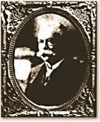

[John Mahlon Marlin: Another Strong Connection to Firearms Manufacturing](http://web.archive.org/web/20210117055054/http://strongfamilyofamerica.org/2012/04/john-mahlon-marlin-another-strong-connection-to-firearms-manufacturing/)

Posted on [April 22, 2012](http://web.archive.org/web/20210117055054/http://strongfamilyofamerica.org/2012/04/john-mahlon-marlin-another-strong-connection-to-firearms-manufacturing/) by [Edward Barnard](http://web.archive.org/web/20210117055054/http://strongfamilyofamerica.org/author/admin/)

The fol­low­ing mate­r­ial is from *Fran­cis Barnard (ca. 1616–1698) and his Descen­dants, A Genealog­i­cal Study, Part A*, by Walther M. Barnard, Ver­sion of 09 August 2009, pages 396–399. Used with permission.

John Mahlon Marlin

John Mahlon Mar­lin: Another *Strong* Connection

to Firearms Manufacturing

Walther M. Barnard, Fre­do­nia, NY 14063

Among some of the fore­most names in Amer­i­can firearm man­u­fac­tur­ing are Brown­ing, Colt, Mar­lin, Rem­ing­ton, Sav­age, Smith *&* Wes­son, and Win­ches­ter. The founders of at least two of these firms are blood rel­a­tives of descen­dants of **Elder John Strong** and Abi­gail Ford through Abigail’s mother, Eliz­a­beth Chard. **Eliphalet Rem­ing­ton, Jr.** (1793–1861) descended from Eliz­a­beth Chard and her first hus­band, Aaron Cooke, and **Samuel Colt** (1814–1862) descended from Eliz­a­beth and her sec­ond hus­band, Thomas Ford. Both were iden­ti­fied as notable kin in an arti­cle pub­lished by the SFAA Newslet­ter in Octo­ber 2000. Their lines of ascent are given in Gary Boyd Roberts’ “The New Eng­land Ances­try of H.R.H. The Princess of Wales” (repro­duced in Genealo­gies of Con­necti­cut Fam­i­lies, Vol. III, on Fam­ily Tree Maker CD \#179 Fam­ily His­tory: Con­necti­cut Genealo­gies \#1, 1600s-1800s).

**John Mahlon Mar­lin** (1836–1901), founder, pres­i­dent and trea­surer of The Mar­lin Firearms Co., of New Haven, CT is now iden­ti­fied as the hus­band of a 5th great grand­daugh­ter of Elder John Strong, mak­ing him a notable spouse of kin. Mar­lin mar­ried Martha Susan Moore8 (Susan A. Barnard7 + Henry Bacon Moore; Samuel Barnard6 + Keziah Thrall; Samuel Barnard5 + Rox­ana Barnard \[first cousin\]; Fran­cis Barnard4 + Lucre­tia Pin­ney; Joseph Barnard Jr.3 + Abi­gail Gris­wold; Joseph Barnard Sr.+ Sarah Strong2; Elder John Strong1 + Abi­gail Ford).

John Mahlon Mar­lin was born 6 May 1836 at Suffield, Hart­ford Co., CT, son of Mahlon and Jen­nette (Brad­ford) Mar­lin. He mar­ried Martha Susan Moore on 27 May 1862 in the Rain­bow sec­tion of Wind­sor, CT, and ulti­mately died 1 July 1901 at New Haven, CT. Two sons, Mahlon Henry, born 23 July 1864, and John Howard, born 21 Sept. 1876, lived to matu­rity. A third son, Bur­ton Lewis, born 14 May 1867, died 12 April 1869, and daugh­ter Jen­nette Brad­ford, born 14 May 1867, died 12 April 1869, per Moore, Horace L., 1903, *Andrew Moore of Poquonock and Wind­sor, Conn., and His Descen­dants*: Jour­nal Pub­lish­ing Co., Lawrence, KS, p. 176.

A his­tory of the Mar­lin Firearms Co. posted at [http://www.marlinfirearms.com](http://web.archive.org/web/20210117055054/http://www.marlinfirearms.com/history/index.php) on the Inter­net notes that John M. Mar­lin served his appren­tice­ship as a tool and die maker, worked at the Colt plant in Hart­ford dur­ing the Civil War, and, in 1870, hung out his own sign on State Street in New Haven and began man­u­fac­tur­ing a line of revolvers, pis­tols and der­ringers, the start of one of the industry’s largest oper­a­tions. His phi­los­o­phy was to man­u­fac­ture bet­ter prod­ucts than his com­peti­tors, and he showed a fierce pride in the guns that bore his name. His guns can still be seen to this day, on web­sites like [the gun source](http://web.archive.org/web/20210117055054/http://www.thegunsource.com/best-rifle-scopes/). Mar­lin rifles are renowned for design longevity and man­u­fac­tur­ing qual­ity: Mod­els 39 and 336, orig­i­nally intro­duced as Mod­els 1891 and 1893 respec­tively, are the old­est shoul­der arm designs in the world still being pro­duced and still mir­ror the orig­i­nal designs. Today Mar­lin (under own­er­ship of the Kenna fam­ily) is the largest man­u­fac­turer of .22 rifles in America.

Mar­lin pro­duced Bal­lard rifles, one of the period’s finest sin­gle shot rifles, in both tar­get and hunt­ing styles from 1875 until about 1890, in cal­ibers rang­ing from .22 to .50. The Bal­lard was pre­ferred by many of America’s top marks­men at a time when tar­get shoot­ing was a pop­u­lar national pastime.

A team of out­stand­ing inven­tors joined Mar­lin in New Haven. They devel­oped the Mar­lin Model 1881, a rugged repeat­ing lever rifle first offered in .45/70 Govt. It was the most pow­er­ful repeat­ing rifle made, and an instant suc­cess. The U.S. Army pro­vided a ready mar­ket for it. Hunters in the West demanded it.

To cir­cum­vent the prob­lems of unde­pend­able ammu­ni­tion and top ejec­tion leav­ing the shooter vul­ner­a­ble when a car­tridge burst and drove gases into the action, Mar­lin in 1889 intro­duced the world’s first side eject­ing, solid-top receiver, which he called the “Mar­lin Safety”–probably his most last­ing improve­ment. The com­bi­na­tion of side ejec­tion and solid-top receivers per­mits cor­rect scope mount­ing, low and cen­tered over the bore, and results in a stronger action.

In 1893, Mar­lin pro­duced a new action for Mar­lin .32/40 and .38/55 car­tridges. When the .30/30 intro­duced smoke­less pow­der, he added that cal­iber. Re-designed and re-designated Model 336 in 1948, it is cur­rently one of the country’s pre­mier deer rifles, and well over three mil­lion have been made since the orig­i­nal 1893 was introduced.

Mar­lin guns, espe­cially the Model 1897 lever action .22 repeater, have been the favorites of many exhi­bi­tion shoot­ers. Annie Oak­ley, Frank E. Miller, Capt. A.H. Hardy, Mr. and Mrs. Gus Peret and Tom Mix were among sharp­shoot­ers who trav­eled the world over and demon­strated their skills before mil­lions of people.

Mar­lin intro­duced a very pop­u­lar pump shot­gun in 1898 fea­tur­ing an exposed (out­side) ham­mer. The gun was favored by exhi­bi­tion shoot­ers. Using two Mar­lin shot­guns, one at each shoul­der, Frank Miller, of the “Cheyenne Fron­tier Days Wild West Show”, used to break two tar­gets at the same instant.

When John Mar­lin died in 1901, his two sur­viv­ing sons took over the busi­ness and began a diver­si­fi­ca­tion pro­gram. They bought the Ideal Man­u­fac­tur­ing Com­pany, which was sold in 1925 to Lyman. Other prod­ucts in 1916 were a com­bi­na­tion shoehorn-buttonhook, decoy anchors and hand­cuffs. With World War I in progress, a New York syn­di­cate bought the com­pany in 1915 and renamed it the Mar­lin Rock­well Cor­po­ra­tion. The firm made machine guns for the U.S. and its allies and became one of the largest machine gun pro­duc­ers in the world.

In 1924 the firearms oper­a­tion was pur­chased by lawyer Frank Kenna, and the Mar­lin Firearms Com­pany has been owned by the Kenna fam­ily ever since. Kenna rein­tro­duced sev­eral of the mod­els famous before World War I and in 1936 estab­lished the Mar­lin razor blade busi­ness. After 100 years of oper­a­tion in New Haven, the com­pany opened its sec­ond cen­tury with a move in 1969 to a new, more effi­cient plant with mod­ern equip­ment in North Haven, Connecticut.

John Mar­lin was a pio­neer. He built a mighty busi­ness based on man­u­fac­tur­ing qual­ity, good design and a prac­ti­cal approach to mar­ket­ing. The com­pany he founded still remains ded­i­cated to those same prin­ci­ples (so says the com­pany propaganda!).