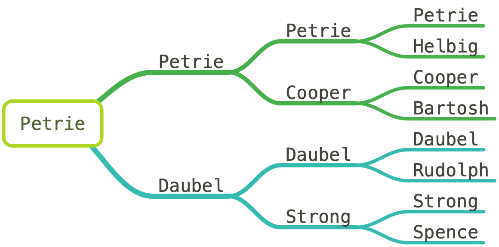

[Genealogy](Genealogy/Petrie_Family_History.md)

# Family Stories and Biographies

This site traces the story of eight interconnected families across three generations to my great-grandparents —from their European origins to their lives in frontier America, and eventually into towns and cities of the Inland Northwest. For each of these eight families, I wrote a story about their journey. These narratives preserve the cultural and personal legacies of the Petrie, Cooper, Helbig, Bartosh, Daubel, Strong, Rudolph, Spence, and other families that contributed to this lineage.

Have you ever wondered where our ancestors came from? If we go back four generations to my 2X great grandparents, only four out of sixteen people were born in the US. The rest were immigrants. Looking at the nationalities of the fourth generation, I found eight Germans, five English, two Czechs, and one Swede. The four US lines of Cooper, Lanphere, Strong, and Newman have a long history in the US, dating back to the 1600s and the great migration.

## [Petrie](Genealogy/Family_Stories/Petrie_Families/Petrie.md)

### German Immigrants to Minnesota
- [Matthias Petri (1846-1925)](Matthias%20Petri%20(1846-1925).md) - immigrant patriarch, born 1839 in Saarland
- [John Petri (1875-1913)](John%20Petri%20(1875-1913).md)- logger, homesteader, Justice of the Peace

### From Minnesota to Washington
- [Robert Petrie (1904-2002)](Genealogy/Biographies/Petrie%20Biographies/Robert%20Petrie%20(1904-2002).md) - logger, carpenter, Spokane foreman

----

## [Cooper](Genealogy/Family_Stories/Petrie_Families/Cooper.md)

### Pennsylvania to the Praries
- [Oscar Cooper (1847–1911)](Oscar%20Cooper%20(1847–1911).md) - patriarch, frontier farmer
- [Charles Cooper (1879–1948)](Charles%20Cooper%20(1879–1948).md) - son of Oscar, farmer and Bemidji settler

### From the prairie to western pines
- [Gladys Cooper  (1909–2002)](Gladys%20Cooper%20%20(1909–2002).md) - Nurse, camp cook, beloved grandmother

----

## [Helbig](Genealogy/Family_Stories/Petrie_Families/Helbig.md)

### German immigrants to New Mexico
- [Robert Helbig  (1852–1937)](Robert%20Helbig%20%20(1852–1937).md) - baker, teacher, frontiersman

### From the sands of New Mexico to the snow of Minnesota
- [Gertrude Helbig  (1882–1981)](Gertrude%20Helbig%20%20(1882–1981).md) - resilient matriarch, lived to 99

----

## [Bartosh](Genealogy/Family_Stories/Petrie_Families/Bartosh.md)

### Rural Czech farms to Iowa
- [Frank Bartosh  (1864–1919)](Frank%20Bartosh%20%20(1864–1919).md) - Bohemian-born farmer and pioneer

### Midwest Prairie woman
- [Anna Bartosh  (1888-1964)](Anna%20Bartosh%20%20(1888-1964).md) - Pioneer women, beloved grandmother

----

## [Daubel](Genealogy/Family_Stories/Petrie_Families/Daubel.md)

### Bonfeld Germany to Elk, WA
- [Ludwig Daubel  (1839-1924)](Ludwig%20Daubel%20%20(1839-1924).md) - blacksmith, patriarch, immigrant pioneer
- [Charles Daubel (1873–1950)](Charles%20Daubel%20(1873–1950).md) - farmer, sawmiller, father of eleven

### Quiet Man of the Northwest Woods
- [Herman Daubel (1903–1977)](Herman%20Daubel%20(1903–1977).md) - eldest son, logger, farmer, Kaiser Aluminum worker

----

## [Strong](Genealogy/Family_Stories/Petrie_Families/Strong.md)

### Westward Migration
- [Walter Strong (1855–1921)](Walter%20Strong%20(1855–1921).md) - early settler of Wild Rose Prairie

### Wildrose Prairie Settlers
- [William Strong (1887–1967)](William%20Strong%20(1887–1967).md) - farmer and patriarch
- [Thressa Strong (1915–2002)](Thressa%20Strong%20(1915–2002).md) - matriarch, raised six children on the Daubel farm

----

## [Rudolph](Genealogy/Family_Stories/Petrie_Families/Rudolph.md)

### Tragedy in Bempflingen
- [Jacob Rudolph (1853–1933)](Jacob%20Rudolph%20(1853–1933).md) - German immigrant, laborer in Philadelphia

### From Bempflingen to Elk
- [Marie Rudolph (1878–1939)](Marie%20Rudolph%20(1878–1939).md) - daughter, pioneer mother of eleven

----

## [Spence](Genealogy/Family_Stories/Petrie_Families/Spence.md)

### Pioneer Teamster
- [John Spence (1835–1916)](John%20Spence%20(1835–1916).md) - Yorkshire-born teamster, frontier pioneer

### Woman of the West
- [Josephine Spence (1889–1972)](Josephine%20Spence%20(1889–1972).md) - twin, matriarch, bearer of family stories

[Index](/contents.md)